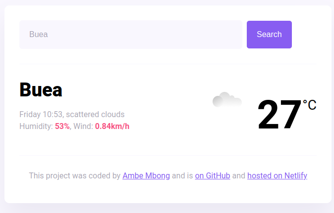
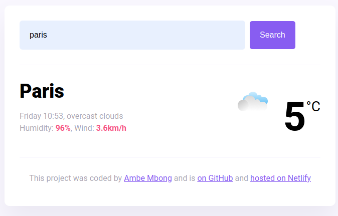
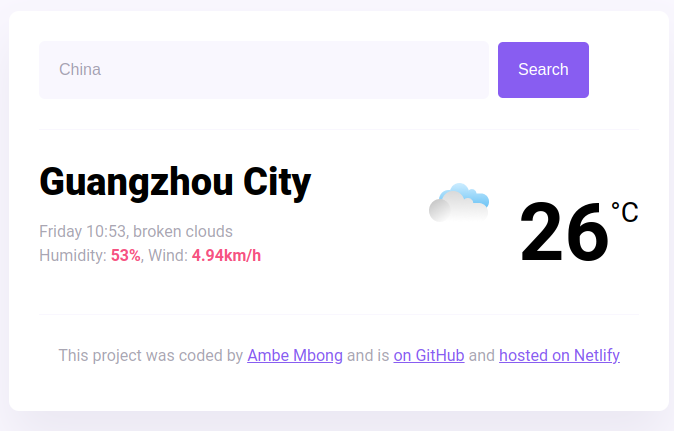
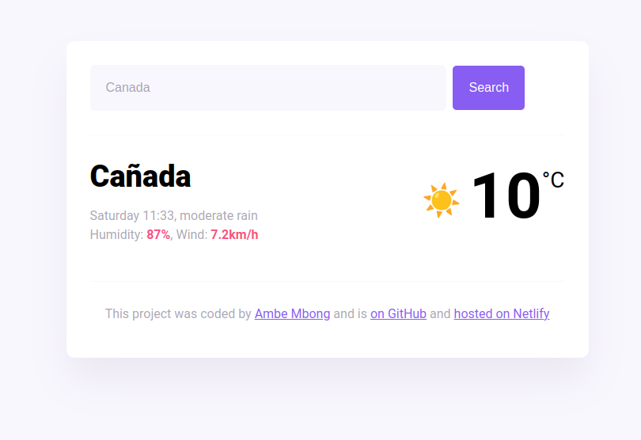

# Shecodes Frontend Web Design Week Five

Webpage that allows the user to search for the weather details in any city and get current results.

## Table of contents

- [Screenshot]
- [Built with]
- [What I learned]
- [Author]

### Screenshot

### Built with

- Semantic HTML5 markup
- CSS custom properties
- Vanilla Javascript
- API - Axios

### What I learned

- How to use the weather API with the help of Axios to incorporate weather details in the project for different cities.
- Use functions to format the weather details to display the way I please.

## Author

- Author - [Ambe Mbong-Nwi Nchang](https://github.com/Ambe-Mbong-Nwi)
- Source Code - [Github](https://github.com/Ambe-Mbong-Nwi/Shecodes_Hosting_Challenge)
- Hosting - [Netlify](https://dreamy-semifreddo-71c770.netlify.app/)
